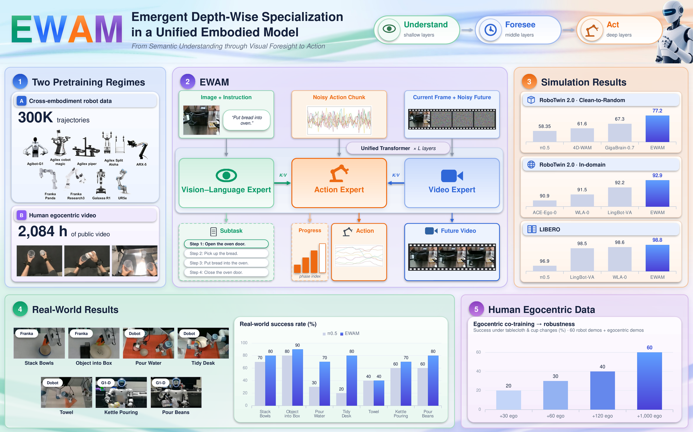
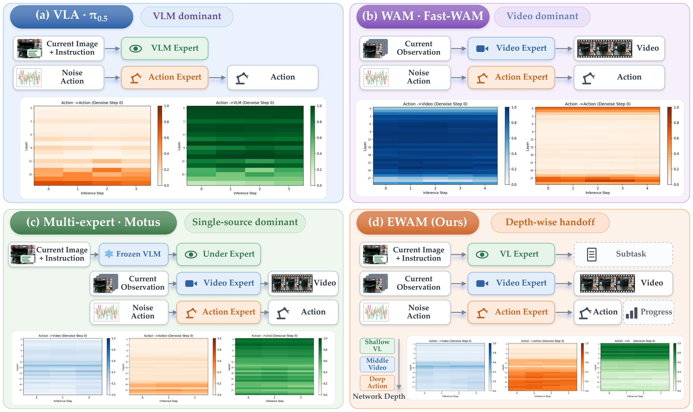

# EWAM: Emergent Depth-Wise Specialization in a Unified Embodied Model -- From Semantic Understanding through Visual Foresight to Action

<p align="center">
  <a href="https://wanghao00pro.github.io/EWAM-project/"></a>
  <a href="https://arxiv.org/abs/2609.39973"></a>
  <a href="https://huggingface.co/HaoWang00/EWAM"></a>
</p>

## 📃 Overview

<p align="center">
  
</p>

EWAM is an action-centric unified embodied model. A vision-language expert (Qwen3-VL-2B), a video expert (Wan2.2-TI2V-5B), and a lightweight action expert are denoised jointly in one flow-matching Diffusion Transformer. Through asymmetric joint attention, action tokens read semantic, current-visual, predicted-future, and action information at every layer, while the perceptual experts stay within their own streams. Without layer-wise supervision, EWAM develops an **emergent depth-wise specialization**: action queries attend mainly to vision-language features in shallow layers, to predicted future frames in intermediate layers, and to action tokens themselves in deep layers.

## 🌟 Key Features

- **Action-centric unified architecture:** One action stream reads the vision-language, video, and action experts at every depth. The attention mask defines which sources are reachable, not which layer should use them.
- **Emergent understand → foresee → act handoff:** The depth-wise routing replicates across all 50 RoboTwin tasks and is stable across denoising steps. Masking predicted-future keys in the middle layers drops success from 92.8% to 3.55%.
- **Two pretraining regimes:** About 1,800 hours (300K trajectories) of cross-embodiment robot data, and about 2,084 hours of human egocentric video expressed in a shared camera-relative wrist-motion space.
- **Human data for transfer and robustness:** Human pretraining raises held-out-embodiment success on Aloha-Agilex-2 from 36.2% to 66.9% at a matched training budget. Egocentric co-training improves real-robot robustness under tablecloth and cup changes.
- **Long-horizon awareness:** Optional subtask and phase-progress heads during post-training, with no external planner.

<p align="center">
  
</p>
<p align="center"><em>Action-attention routing across paradigms. VLA, WAM, and multi-expert policies concentrate action attention on one source; EWAM hands attention off from vision-language, to predicted future, to action as depth grows.</em></p>

## 📊 Results

| Benchmark | Setting | Success rate (%) |
|---|---|---|
| RoboTwin 2.0 | Clean-to-random (C2C / C2R / Avg.) | 82.2 / 72.1 / **77.2** |
| RoboTwin 2.0 | In-domain (Clean / Randomized / Avg.) | 93.0 / 92.8 / **92.9** |
| LIBERO | Spatial / Object / Goal / Long / Avg. | 98.6 / 99.8 / 98.6 / 98.2 / **98.8** |

Real-robot results on Franka, Dobot, and Unitree G1-D are reported in the [technical report](https://arxiv.org/abs/2609.39973) and on the [project page](https://wanghao00pro.github.io/EWAM-project/).

## 📚 Contents

- `models/`, `train/`, `utils/`: EWAM model (VL, video, and action experts with asymmetric joint attention) and the shared training entry point.
- `wan/`: Wan2.2 official code (Alibaba), vendored.
- `data/robotwin2/`: RoboTwin 2.0 dataset loader and data conversion tools.
- `data/libero/`, `experiments/libero/`, `eval_scripts/`: LIBERO dataset loader, rollout helpers, and evaluation.
- `configs/`, `scripts/`: training and evaluation configs and launchers.
- `inference/robotwin/`: self-contained RoboTwin 2.0 policy deployment.

## 🚀 Installation

```bash
conda create -n ewam python=3.10 -y
conda activate ewam

# torch (CUDA 12.6 wheels — adjust the index-url for your CUDA version)
pip install torch==2.7.1 torchvision==0.22.1 --index-url https://download.pytorch.org/whl/cu126

# optional: flash-attention kernels (Wan attention falls back to PyTorch SDPA without it)
pip install flash-attn --no-build-isolation

pip install -r requirements.txt
```

## 💾 Model Weights

### Released EWAM checkpoints

All checkpoints are hosted on 🤗 [HaoWang00/EWAM](https://huggingface.co/HaoWang00/EWAM).

| Checkpoint | Folder | Usage |
|---|---|---|
| [Pretrain (multi-source, stage-1)](https://huggingface.co/HaoWang00/EWAM) | [`pretrain/`](https://huggingface.co/HaoWang00/EWAM) | Initialization for stage-2 finetuning |
| [RoboTwin 2.0 clean-to-random](https://huggingface.co/HaoWang00/EWAM) | [`robotwin-c2r/`](https://huggingface.co/HaoWang00/EWAM) | RoboTwin 2.0 evaluation |
| [RoboTwin 2.0 in-domain](https://huggingface.co/HaoWang00/EWAM) | [`robotwin-indomain/`](https://huggingface.co/HaoWang00/EWAM) | RoboTwin 2.0 evaluation |
| [LIBERO](https://huggingface.co/HaoWang00/EWAM) | [`libero/`](https://huggingface.co/HaoWang00/EWAM) | LIBERO evaluation |

```bash
pip install -U "huggingface_hub"
huggingface-cli download HaoWang00/EWAM --local-dir /path/to/ewam_weights
# or a single checkpoint, e.g. LIBERO
huggingface-cli download HaoWang00/EWAM --include "libero/*" --local-dir /path/to/ewam_weights
```

### Base models

The base models are not included in the EWAM release; download them from the official repositories.

| Component | Base model | Parameters |
|---|---|---|
| Video expert | [Wan2.2-TI2V-5B](https://huggingface.co/Wan-AI/Wan2.2-TI2V-5B) | ~5.00B |
| Vision-language expert | [Qwen3-VL-2B-Instruct](https://huggingface.co/Qwen/Qwen3-VL-2B-Instruct) | ~2.44B |

See [Model Weights and Configuration](docs/model_weights.md) for which config field each checkpoint and base model plugs into.

## 🏋️ Post-training and Evaluation

### RoboTwin 2.0

See the [RoboTwin guide](docs/robotwin/README.md) for data preparation, training, and evaluation.

### LIBERO

See the [LIBERO guide](docs/libero/README.md) for data preparation, training, and evaluation.

Common issues are collected in the [FAQ](docs/FAQ.md).

## 🖊 Citation

If you find EWAM useful in your research, please cite:

```bibtex
@article{wang2026ewam,
  title   = {{EWAM}: Emergent Depth-Wise Specialization in a Unified Embodied Model -- From Semantic Understanding through Visual Foresight to Action},
  author  = {Wang, Hao and Wen, Jiajun and Liu, Jingzhi and Xue, Shuoshuo and Chen, Zhiliang and Lin, Min and Chang, Yicheng and Guo, Xiaoyu and Zhuo, Yukang and Chong, Zheng and Nie, Yunshuang and Zhang, Jian and Liufu, Weijia and Wu, Qingman and Xu, Heming and Song, Bingchang and Wu, Dantong and Wang, Zhiyuan and Xu, Hang and Han, Jianhua and Chen, Bokui and Zhao, Shen and Li, Rui and Liang, Xiaodan},
  journal = {arXiv preprint arXiv:2609.39973},
  year    = {2026}
}
```

## 🙏 Acknowledgements

- [Wan2.2](https://github.com/Wan-Video/Wan2.2) (Alibaba) — video backbone, VAE and T5 modules (vendored under `wan/`).
- [Qwen3-VL](https://github.com/QwenLM/Qwen3-VL) — vision-language model.
- [LIBERO](https://github.com/Lifelong-Robot-Learning/LIBERO) — simulation benchmark.
- [RoboTwin2.0](https://github.com/RoboTwin-Platform/RoboTwin) — deployment benchmark and training data source.
- [Motus](https://github.com/thu-ml/Motus) — the RoboTwin data conversion and evaluation integration reference Motus.
- [FastWAM](https://github.com/yuantianyuan01/FastWAM) — LIBERO evaluation protocol and parallel scheduling lineage.

## 📄 License

This repository is released under the [Apache License 2.0](LICENSE). The vendored `wan/` code (Wan2.2, © Alibaba) retains its original Apache 2.0 copyright headers.
